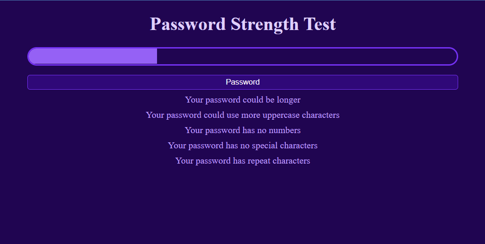

# Regex Project - Password Strength Test

A javascript application to test the password and display weaknesses in it.

## Initial Page

## Password with all weaknesses

## Password with repeated character weakness

## A strong password

